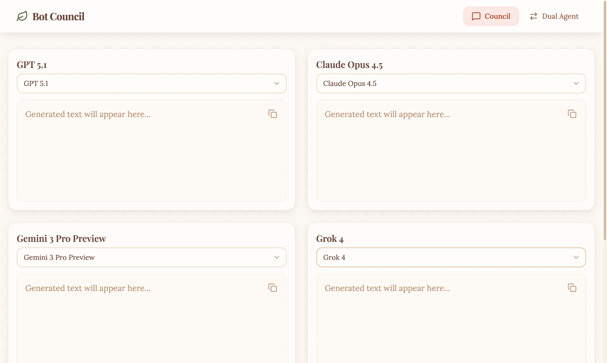

# Bot Council

> Compare AI responses side-by-side. Query multiple LLMs simultaneously and watch their responses stream in real-time.

Bot Council is a web application that lets you send a single prompt to up to 4 different AI models at once, compare their responses, and even synthesize them into a unified answer. It also features a unique **Dual Agent Chat** mode where two AI models engage in automated discussion on any topic.



## Project Highlights

- **Multi-Model Comparison**: Query up to 4 LLMs in parallel with a single prompt
- **Real-Time Streaming**: Watch responses generate live with Server-Sent Events
- **Response Synthesis**: Combine insights from all models into one improved answer
- **Dual Agent Dialogue**: Watch two AI models debate and discuss any topic autonomously
- **100+ Models**: Access GPT, Claude, Gemini, Grok, DeepSeek, and more through OpenRouter
- **Custom Design System**: Warm, earth-tone aesthetic with paper texture effects

## Tech Stack

| Layer | Technology |
|-------|------------|
| Frontend | React 19, Vite, Tailwind CSS |
| Backend | Node.js, Express 5 |
| API | OpenRouter (proxied server-side for security) |
| Icons | Lucide React |

## Quickstart

### Prerequisites

- [Node.js](https://nodejs.org/) v18 or higher
- [OpenRouter API key](https://openrouter.ai/keys) (free tier available)

### Installation

```bash
# Clone the repository
git clone https://github.com/kadenbarthlome/bot_counsel.git
cd bot_counsel

# Install dependencies
npm install

# Copy environment template and add your API key
cp .env.example .env
# Edit .env and add your OPENROUTER_API_KEY

# Start development servers
npm run dev
```

The app will be available at **http://localhost:5174**

### Running Servers Separately

```bash
# Terminal 1 - Backend API (port 3001)
npm run dev:backend

# Terminal 2 - Frontend (port 5174)
npm run dev:frontend
```

## Usage

### Council Mode (Multi-Model Comparison)
1. Select a model for each of the 4 panels using the dropdowns
2. Enter your prompt in the text area
3. Click **Send** (or press `Ctrl+Enter`)
4. Watch responses stream in from all selected models
5. Click **Synthesize** to combine all responses into one unified answer
6. Use the copy button on any panel to copy that response

### Dual Agent Mode
1. Navigate to **Dual Agent** in the navbar
2. Select two different models (Model A and Model B)
3. Enter a discussion topic or question
4. Set the number of turns (1-50)
5. Click **Start Discussion** and watch the AI models debate

### Web Search
Toggle the **Web Search** button to enable real-time web search capabilities for up-to-date information.

### Example Prompts to Try

**Council Mode:**
- "Explain quantum computing in simple terms"
- "What are the pros and cons of remote work?"
- "Write a haiku about artificial intelligence"

**Dual Agent Mode:**
- "Debate whether artificial general intelligence will be achieved by 2030"
- "Discuss the ethical implications of self-driving cars"
- "Compare functional vs object-oriented programming"

> **Tip:** Enable Web Search for current events queries like "What happened in tech news this week?"

## Configuration

### Customizing Models

Models are loaded from `public/models.txt`. Each line contains a model ID and display name separated by a comma:

```
# Model ID,Human-readable Name
openai/gpt-5.1,GPT 5.1
anthropic/claude-opus-4.5,Claude Opus 4.5
google/gemini-3-pro-preview,Gemini 3 Pro
```

Find available model IDs at [openrouter.ai/models](https://openrouter.ai/models)

### Environment Variables

| Variable | Required | Default | Description |
|----------|----------|---------|-------------|
| `OPENROUTER_API_KEY` | Yes | - | Your OpenRouter API key |
| `APP_URL` | No | `http://localhost:5174` | Application URL for API headers |
| `PORT` | No | `3001` | Backend server port |

## Available Scripts

| Command | Description |
|---------|-------------|
| `npm run dev` | Start both frontend and backend concurrently |
| `npm run dev:frontend` | Start Vite dev server only |
| `npm run dev:backend` | Start Express server only |
| `npm run build` | Build for production |
| `npm run preview` | Preview production build |
| `npm run lint` | Run ESLint |

## Architecture

```
Client (React)  ──>  Express Proxy  ──>  OpenRouter API
     │                    │
     │              API key stays
     │              server-side
     ▼
  Streaming SSE Response
```

The backend server proxies all API requests to OpenRouter, keeping your API key secure and never exposing it to the browser.

## Troubleshooting

| Issue | Solution |
|-------|----------|
| "API key not configured" | Ensure `.env` file exists with valid `OPENROUTER_API_KEY` |
| Port 3001 already in use | Change `PORT` in `.env` or stop the conflicting process |
| Models not loading | Check that `public/models.txt` exists and has valid entries |
| CORS errors | Ensure both frontend and backend are running |
| Empty responses | Verify your OpenRouter account has credits |

See [OpenRouter documentation](https://openrouter.ai/docs) for API-specific issues.

## Roadmap

- [ ] Add screenshot/GIF to README
- [ ] Conversation history persistence (localStorage)
- [ ] Export conversations to Markdown
- [ ] Dark mode support
- [ ] Cost tracking per model
- [ ] Unit and integration tests

## License

MIT License - see [LICENSE](LICENSE) for details.

---

Built with React, Express, and the OpenRouter API.
